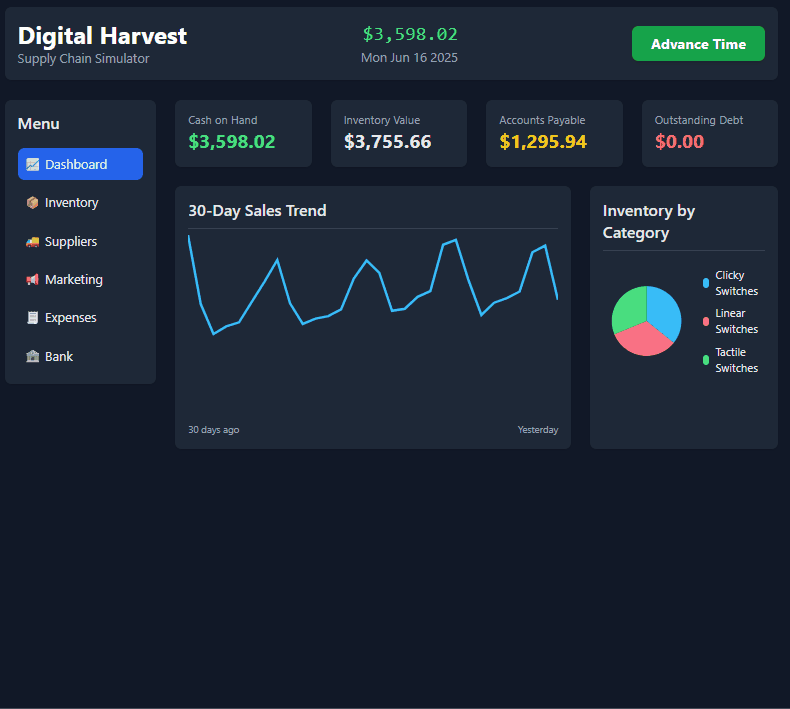
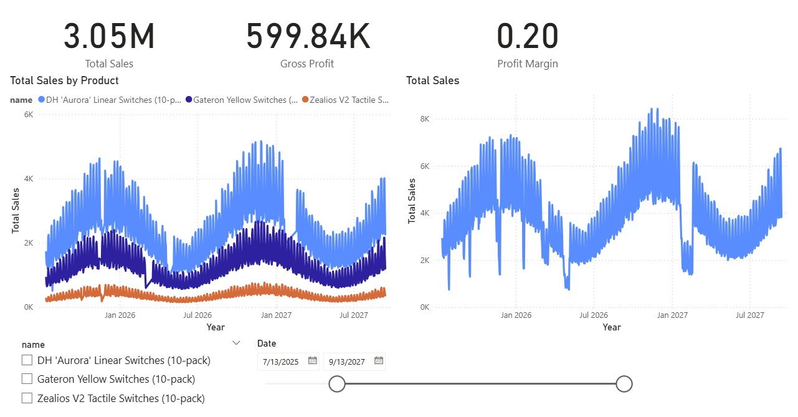
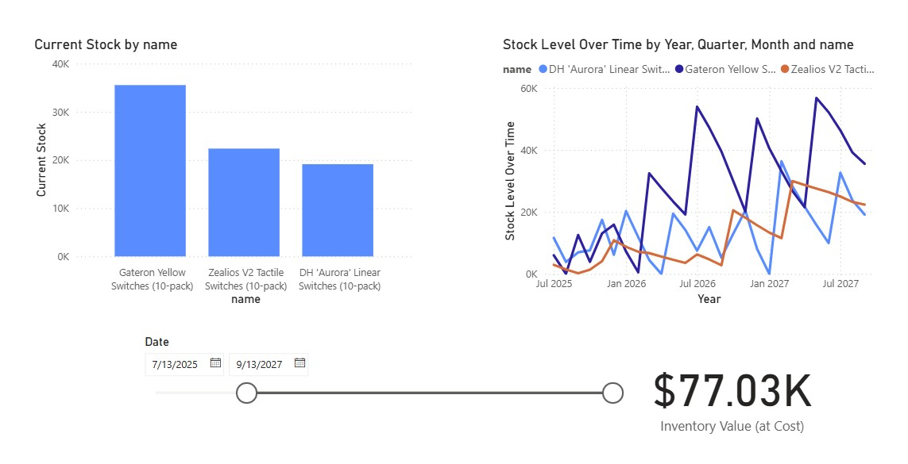

# Digital Harvest - Accounting-Based Business Simulator

## Project Objective

Digital Harvest is an interactive, terminal-based business simulation engine built on a foundation of real-world accounting principles. This project was designed to create a "digital twin" of a retail business, allowing a user to make high-level strategic decisions about inventory, pricing, and expenses, while accurately tracking the downstream impact on a double-entry accounting ledger.

The primary goal is to provide a robust backend and data model that can be used for sophisticated business intelligence analysis, answering not just "What did we sell?" but "Was the business profitable, and why?" This project showcases the powerful intersection of software engineering, database design, and financial analysis.

## Table of Contents
- [Core Features](#core-features)
- [Tech Stack](#tech-stack)
- [Dashboard & Analysis](#dashboard--analysis)
- [Setup Instructions](#setup-instructions)
- [Database Schema](#database-schema)

## Core Features

### Simulation Engine

* **Double-Entry Accounting:** Every transaction generates corresponding entries in a financial ledger, accurately tracking assets, revenue, and costs according to standard accounting principles.
* **Perpetual Inventory System:** An inventory ledger tracks the quantity and value of stock in real-time as purchases and sales occur.
* **Dynamic Sales Modeling:** A sophisticated sales model that factors in long-term trends, seasonality, weekly cycles, and price sensitivity to generate realistic demand.
* **Market Events System:** Random market events create temporary demand boosts for specific product categories, adding strategic depth.
* **Progressive Product Unlocks:** New products become available as your business grows, expanding your catalog over time.
* **Multi-Vendor Supply Chain:** Source products from different vendors with varying lead times, costs, and minimum order requirements.
* **Banking & Loan System:** Access business loans to fund growth, with realistic repayment terms and interest calculations.
* **Persistent State:** The simulation's state (cash on hand, current date) is persisted in the database, allowing it to be stopped and restarted seamlessly.

### User Interfaces & Analysis
* **Enhanced Web UI (v2):** A comprehensive React-based dashboard with multiple pages for inventory management, supplier relationships, marketing campaigns, expense tracking, and financial analysis.
* **Real-time Debug Tools:** Built-in debugging panels to monitor sales activity, inventory changes, and system performance.
* **Terminal Application:** A classic command-line interface provides an alternative way to manage the business day-by-day.
* **BI-Ready Schema:** The normalized MySQL database is designed for direct connection with business intelligence tools like Power BI, enabling the creation of live, interactive dashboards.

## Tech Stack

* **Backend:** Python 3
* **Database:** MySQL
* **Frontend:** React with Tailwind CSS for styling.
* **Data Analysis:** Microsoft Power BI
* **Key Libraries:** `mysql-connector-python`, `flask`, `flask-cors`


## Dashboard & Analysis

The data generated by the simulation is visualized in a multi-page Power BI dashboard designed to provide a comprehensive business overview. The web UI provides direct operational control over the business.

### Web Interface v2 (Interactive Dashboard)



*The enhanced v2 web interface featuring real-time inventory management, supplier relationships, marketing campaigns, and financial tracking.*

### Power BI Analytics

* **Sales Dashboard:** Tracks high-level KPIs like Gross Profit and Profit Margin, with detailed trend analysis by product.


* **Inventory Dashboard:** Provides a snapshot of current stock levels and a historical view of inventory fluctuations over time.



* **Expenses Dashboard (Web UI):** Allows for real-time management of business overhead. Users can add, view, and delete recurring monthly or daily expenses, as well as record one-off costs.


## Setup Instructions

### Prerequisites

* Python 3
* A running MySQL server

### 1. Database Setup

1.  Ensure your MySQL server is running.
2.  Update the `DB_CONFIG` dictionary in `/src/setup_business.py` and `/src/digital_harvest.py` with your MySQL credentials (user, password, host, port).

### 2. Install Dependencies

Install the required Python package using the `requirements.txt` file:
```bash
pip install -r requirements.txt
```

### 3. Initialize the Database
Run the setup script **once** from your terminal. This will create the `digital_harvest` database, build the required tables, and populate the initial product catalog.
```bash
python src_v2/setup_v2.py
```

*Note: This script will completely drop and recreate the database each time it is run.*

### 4. Run the Simulation
You can run either the Web UI or the Terminal version.

**To use the Web UI v2 (Recommended):**
1. Start the backend API server:
   ```bash
   python src_v2/api_v2.py
   ```
2. Open the `index_v2.html` file in your web browser.

**To use the Web UI v1:**
1. Start the backend API server:
   ```bash
   python src_v2/api_v2.py
   ```
2. Open the `index_v1.html` file in your web browser.

**To use the Terminal Application:**
```bash
python src_v2/cli_v2.py
```

## Database Schema

| Table Name | Description |
| :--- | :--- |
| `products` & `categories` | Stores the product catalog, including metadata used by the sales simulation AI. |
| `inventory_ledger` | A perpetual log of all inventory movements. Each entry records the change in quantity, the value of the transaction, and the resulting quantity on hand. |
| `financial_ledger` | A classic double-entry accounting ledger. Every business event creates corresponding debit and credit entries, ensuring the accounting equation remains in balance. |

## Project Structure

```
digital-harvest/
├── src/              # Original implementation
├── src_v1/           # First new version
├── src_v2/           # Enhanced v2 implementation (recommended)
│   ├── engine_v2.py  # Core business simulation engine
│   ├── api_v2.py     # Flask REST API
│   ├── cli_v2.py     # Terminal interface
│   └── setup_v2.py   # Database initialization
├── index.html        # Simple working model
├── index_v1.html     # Basic web interface with expenses
├── index_v2.html     # Enhanced web interface with dashboard (recommended)
└── screenshots/      # Dashboard examples
```

## What's New in v2

* **Multi-page Web Interface:** Dedicated pages for Dashboard, Inventory, Suppliers, Marketing, Expenses, and Banking
* **Market Events:** Dynamic events that boost demand for specific product types
* **Progressive Unlocks:** Products unlock as your business reaches revenue milestones
* **Enhanced Vendor System:** Multiple suppliers with different terms, lead times, and relationships
* **Loan System:** Access business financing with realistic terms
* **Debug Tools:** Built-in debugging panels to monitor simulation activity
* **Improved Sales Model:** More sophisticated demand calculation with product-specific attributes
