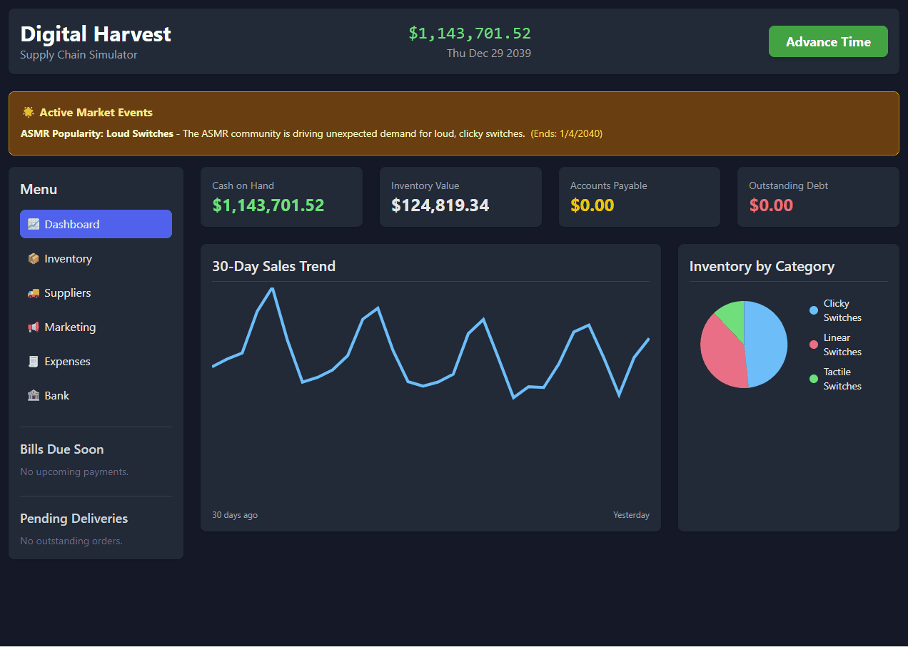

# Digital Harvest - Accounting-Based Business Simulator

[](https://www.python.org/)
[](https://www.mysql.com/)
[](https://reactjs.org/)
[](https://powerbi.microsoft.com/)
[](https://tailwindcss.com/)

> A sophisticated business simulation engine built on real-world accounting principles, providing an interactive platform for strategic decision-making and financial analysis.

---

## 📋 Table of Contents

- [About the Project](#about-the-project)
- [Demo](#demo)
- [Core Features](#core-features)
- [Tech Stack](#tech-stack)
- [Getting Started](#getting-started)
  - [Prerequisites](#prerequisites)
  - [Installation](#installation)
  - [Running the Application](#running-the-application)
- [Dashboard & Analytics](#dashboard--analytics)
- [Database Architecture](#database-architecture)
- [Project Structure](#project-structure)
- [Roadmap](#roadmap)
- [Contributing](#contributing)
- [License](#license)
- [Contact](#contact)

---

## 🎯 About the Project

**Digital Harvest** is an interactive business simulation engine that models a retail business with **real-world accounting accuracy**. Unlike typical business games, this simulator maintains a complete **double-entry accounting system**, tracking every transaction through a financial ledger that follows GAAP principles.

### The Vision

The project creates a "digital twin" of a retail business, allowing users to:
- Make high-level strategic decisions about inventory, pricing, and marketing
- See the immediate financial impact of their choices
- Understand the connection between operations and profitability
- Learn business principles through hands-on experimentation

### Why This Matters

Most business simulations simplify or ignore accounting. Digital Harvest proves that you can have both **engaging gameplay** and **financial accuracy**. The normalized database schema makes it perfect for:
- 📊 **Business Intelligence**: Connect Power BI for real-time dashboards
- 📚 **Education**: Learn accounting principles through interactive simulation
- 🔬 **Analysis**: Answer complex questions like "Which vendor maximizes ROI?"
- 🎮 **Entertainment**: Experience the satisfaction of building a profitable business

**Explore the Stories:** I've documented interesting scenarios and discoveries from the simulation [here](https://matthew-s-jenkins.github.io/digital-harvest-sim/stories/index.html).

---

## 🎬 Demo

### Interactive Web Interface



*Real-time inventory management, supplier negotiations, marketing campaigns, and financial tracking—all in one intuitive dashboard.*

---

## ✨ Core Features

### 💰 Accounting Engine

- **Double-Entry Ledger**: Every transaction creates balanced debit/credit entries
- **Perpetual Inventory System**: Real-time quantity and value tracking
- **Multi-Account Structure**: Cash, Inventory, AP, Revenue, COGS, Operating Expenses
- **Financial Statements**: Auto-generated Balance Sheet and P&L capability

### 📈 Sales & Demand Modeling

- **Realistic Demand Curves**: Long-term trends, seasonality, and weekly patterns
- **Price Sensitivity**: Customer response to pricing changes
- **Market Events**: Random boosts to specific product categories
- **Progressive Unlocks**: New products become available as revenue milestones are reached

### 🚚 Supply Chain Management

- **Multi-Vendor System**: Choose from suppliers with different terms
- **Lead Time Simulation**: Orders arrive after realistic delays
- **Shipping Calculations**: Distance-based and value-based shipping costs
- **Vendor Relationships**: Build rapport to unlock better suppliers

### 💼 Business Operations

- **Marketing Campaigns**: Launch targeted promotions to boost demand
- **Loan System**: Access business financing with realistic APR and terms
- **Recurring Expenses**: Rent, utilities, and operational costs
- **Pricing Control**: Set product prices and see immediate impact on sales

### 🖥️ User Interfaces

- **Web Dashboard**: Multi-page React interface with real-time data
- **Terminal CLI**: Classic command-line interface for purists
- **Power BI Integration**: Connect for advanced analytics and reporting

---

## 🛠️ Tech Stack

| Component | Technology | Purpose |
|-----------|-----------|---------|
| **Backend** | Python 3 | Business logic and simulation engine |
| **Database** | MySQL 8.0+ | Persistent data storage with referential integrity |
| **API** | Flask + Flask-CORS | RESTful API for frontend communication |
| **Frontend** | React 17 | Interactive single-page application |
| **Styling** | Tailwind CSS | Modern, responsive UI design |
| **Analytics** | Power BI | Business intelligence dashboards |
| **Libraries** | `mysql-connector-python` | Database connectivity |

---

## 🚀 Getting Started

### Prerequisites

Before running Digital Harvest, ensure you have:

- **Python 3.8+** installed ([Download](https://www.python.org/downloads/))
- **MySQL Server 8.0+** running locally or remotely ([Download](https://dev.mysql.com/downloads/))
- A modern web browser (Chrome, Firefox, or Edge recommended)

### Installation

1. **Clone the repository**
   ```bash
   git clone https://github.com/yourusername/digital-harvest.git
   cd digital-harvest
   ```

2. **Install Python dependencies**
   ```bash
   pip install -r requirements.txt
   ```

3. **Configure database connection**

   Edit the `DB_CONFIG` dictionary in the following files with your MySQL credentials:
   - `src/setup.py`
   - `src/engine.py`
   - `src/api.py`

   ```python
   DB_CONFIG = {
       'user': 'your_username',
       'password': 'your_password',
       'host': 'localhost',
       'port': 3306
   }
   ```

4. **Initialize the database**

   ⚠️ **Warning**: This will drop and recreate the `digital_harvest` database!

   ```bash
   python src/setup.py
   ```

   You should see output confirming table creation and initial data population.

### Running the Application

#### Option 1: Web Interface (Recommended)

1. **Start the API server**
   ```bash
   python src/api.py
   ```
   You should see: `* Running on http://127.0.0.1:5000`

2. **Open the interface**
   - **Simple**: Double-click `index.html` to open directly in your browser
   - **Server**: For better compatibility, run a local web server:
     ```bash
     python -m http.server 8080
     ```
     Then navigate to: `http://localhost:8080/index.html`

#### Option 2: Terminal Interface

For a classic command-line experience:
```bash
python src/cli.py
```

Follow the on-screen prompts to manage your business day-by-day.

---

## 📊 Dashboard & Analytics

### Web Interface Features

The web dashboard provides six core sections:

1. **📈 Dashboard** - KPIs, sales trends, and inventory breakdown
2. **📦 Inventory** - Stock levels, pricing controls, and product filtering
3. **🚚 Suppliers** - Vendor catalog, ordering interface, and relationship tracking
4. **📢 Marketing** - Campaign launches and performance monitoring
5. **🧾 Expenses** - Recurring cost tracking and analysis
6. **🏦 Bank** - Loan offers and financing options

### Power BI Analytics

The simulation generates data ready for advanced analysis. Connect Power BI to the MySQL database for:

#### 1. Executive Summary Dashboard


**Purpose**: High-level financial health and profitability overview

**Key Visualizations**:
- **KPI Cards**: Cash, AP Due, Gross Profit, Net Profit
- **Monthly P&L**: Revenue vs. Expenses with Net Profit trend
- **Expense Breakdown**: Interactive donut chart of cost structure
- **Working Capital Trend**: Cash balance vs. liabilities over time
- **Date Slicer**: Filter the entire report by time period

#### 2. Supply Chain & Operations Dashboard


**Purpose**: Operational insights connecting physical activities to financial impact

**Key Visualizations**:
- **Accounting Validation**: Real-time verification of double-entry integrity (Total Debits - Total Credits = $0.00)
- **Vendor Scorecard**: Performance metrics (lead time, on-time delivery %)
- **Live Stock Levels**: Current quantity and value for each product
- **Assets & Equity Chart**: Visualization of the accounting equation over time
- **Interactive Slicers**: Filter by vendor or product category

---

## 🗄️ Database Architecture

The database is designed with **normalization** and **referential integrity** in mind:

### Core Tables

| Table | Purpose |
|-------|---------|
| `products` | Product catalog with pricing and demand metadata |
| `product_categories` | Hierarchical categorization (Linear, Tactile, Clicky switches) |
| `vendors` | Supplier information (terms, location, minimums, relationships) |
| `inventory_ledger` | **Perpetual inventory system** - every stock movement with running balances |
| `financial_ledger` | **Double-entry accounting** - debits and credits for all transactions |
| `purchase_orders` | Orders placed to vendors with tracking and status |
| `purchase_order_items` | Line items for each PO |
| `accounts_payable` | Outstanding bills to suppliers |
| `expenses` | Recurring operational costs |
| `loans` | Active financing with repayment schedules |
| `marketing_campaigns` | Active promotions with duration and target |
| `market_events` | Random demand-boosting events |
| `business_state` | Current simulation state (date, cash on hand) |

### Key Design Decisions

- **Immutable Ledgers**: Financial and inventory ledgers are append-only for audit trails
- **Running Balances**: Ledgers include calculated running balances for performance
- **Foreign Keys**: Enforce referential integrity between all related entities
- **Decimal Precision**: All monetary values use `DECIMAL(15,2)` for accuracy
- **Date Tracking**: Every transaction includes timestamps for time-series analysis

---

## 📂 Project Structure

```
digital-harvest/
├── src/                      # Main application code
│   ├── engine.py            # Core simulation engine
│   ├── api.py               # Flask REST API endpoints
│   ├── cli.py               # Terminal interface
│   └── setup.py             # Database initialization and seeding
│
├── index.html               # React-based web interface
├── screenshots/             # Demo images and GIFs
├── oldVersions/             # Archived legacy code
├── requirements.txt         # Python dependencies
└── README.md               # This file
```

---

## 🗺️ Roadmap

### Current Status
- ✅ Full double-entry accounting system
- ✅ Multi-vendor supply chain
- ✅ Marketing campaigns
- ✅ Loan system
- ✅ Market events
- ✅ Web UI with 6 pages
- ✅ Power BI integration

### Planned Enhancements
- [ ] Employee hiring and payroll
- [ ] Customer loyalty system
- [ ] Seasonal inventory planning AI
- [ ] Multi-location expansion
- [ ] Tax accounting and reporting
- [ ] Competitive market simulation
- [ ] Export financial statements (PDF)

---

## 🤝 Contributing

Contributions are welcome! This project is ideal for:
- **Students** learning about databases, accounting, or web development
- **Developers** interested in simulation engines or business logic
- **Educators** looking for teaching tools

### How to Contribute

1. Fork the repository
2. Create a feature branch (`git checkout -b feature/AmazingFeature`)
3. Commit your changes (`git commit -m 'Add some AmazingFeature'`)
4. Push to the branch (`git push origin feature/AmazingFeature`)
5. Open a Pull Request

---

## 📜 License

This project is open source and available under the [MIT License](LICENSE).

---

## 📧 Contact

**Matthew Jenkins**
- GitHub: [@matthew-s-jenkins](https://github.com/matthew-s-jenkins)
- Project Link: [https://github.com/matthew-s-jenkins/digital-harvest-sim](https://github.com/matthew-s-jenkins/digital-harvest-sim)

---

## 🙏 Acknowledgments

- MySQL for providing a robust relational database
- Flask for making API development straightforward
- React and Tailwind CSS for enabling rapid UI development
- Power BI for powerful data visualization capabilities

---

**Built with ❤️ and Python**
